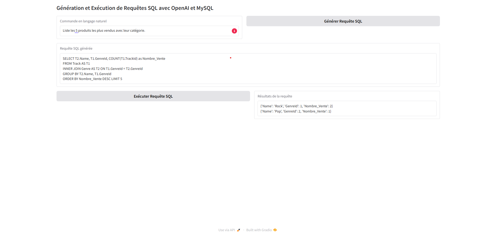

Voici un exemple de **README.md** pour votre application **Text-to-SQL-to-Text**, en suivant les meilleures pratiques pour rendre le projet clair et attractif :

---

# **Text-to-SQL-to-Text**

Cette application interactive permet de générer, exécuter et afficher les résultats de requêtes SQL à partir d'instructions en langage naturel, grâce à l'intégration d'OpenAI et d'une base de données MySQL. Avec une interface utilisateur simple et intuitive créée avec Gradio, elle s'adresse aux développeurs, analystes de données et étudiants en quête d'automatisation SQL.

---

## **Fonctionnalités**

- 💡 **Génération de requêtes SQL** : Transforme des commandes en langage naturel en requêtes SQL optimisées grâce à OpenAI.
- 🛠️ **Exécution directe** : Les requêtes SQL générées sont exécutées dans une base de données MySQL.
- 📊 **Affichage des résultats** : Visualisation des résultats sous forme de texte ou tableau, selon le type de requête.
- 🌐 **Interface utilisateur interactive** : Interface facile à utiliser construite avec **Gradio**.

---

## **Prérequis**

Avant de commencer, assurez-vous que les outils suivants sont installés sur votre système :

- Python 3.7+
- Serveur MySQL en cours d'exécution
- Clé API OpenAI (pour la génération des requêtes SQL)
- Les bibliothèques Python nécessaires (voir [Installation](#installation))

---

## **Installation**

1. **Clonez ce dépôt** :

   ```bash
   git clone https://github.com/votre-utilisateur/text-to-sql-to-text.git
   cd text-to-sql-to-text
   ```

2. **Installez les dépendances** :

   ```bash
   pip install -r requirements.txt
   ```

3. **Configurez l'application** :

   - Mettez à jour le fichier `main-mysql.py` :
     - Ajoutez votre **clé API OpenAI**.
     - Modifiez la configuration de la base de données (`host`, `user`, `password`, `port`, `database`) pour correspondre à votre environnement MySQL.

4. **Lancez l'application** :

   ```bash
   python main-mysql.py
   ```

---

## **Structure du Projet**

- `main-mysql.py` : Code principal de l'application.
- `requirements.txt` : Liste des bibliothèques Python nécessaires.
- `README.md` : Documentation de l'application (ce fichier).

---

## **Comment utiliser l'application**

1. **Démarrez l'interface Gradio** :
   Une fois l'application lancée, une URL sera générée dans la console. Cliquez dessus pour accéder à l'interface utilisateur.

2. **Générez une requête SQL** :
   - Entrez une commande en langage naturel, par exemple :  
     *"Quels sont les clients ayant dépensé plus de 1000€ ?"*
   - Cliquez sur le bouton **Générer Requête SQL**.

3. **Exécutez la requête SQL** :
   - La requête générée apparaît dans la boîte de texte.
   - Cliquez sur **Exécuter Requête SQL** pour voir les résultats.

4. **Consultez les résultats** :
   - Les résultats s'affichent directement dans la boîte de texte en bas de l'interface.

---

## **Exemple**

### Entrée (langage naturel) :
> Liste les 5 produits les plus vendus avec leur catégorie.

### Requête SQL générée :
```sql
SELECT T2.Name, T1.GenreId, COUNT(T1.TrackId) as Nombre_Vente 
FROM Track AS T1 
INNER JOIN Genre AS T2 ON T1.GenreId = T2.GenreId 
GROUP BY T2.Name, T1.GenreId 
ORDER BY Nombre_Vente DESC LIMIT 5
```

### Résultats :
```
{'Name': 'Rock', 'GenreId': 1, 'Nombre_Vente': 2}
{'Name': 'Pop', 'GenreId': 2, 'Nombre_Vente': 1}
...
```

---

## **Personnalisation**

- **Modifier le prompt OpenAI** : Ajustez les instructions du système pour mieux guider la génération des requêtes SQL.
- **Changer la base de données** : Remplacez MySQL par un autre système de gestion de base de données en adaptant la logique de connexion.

---

## **Technologies utilisées**

- **Python** : Langage principal de développement.
- **Gradio** : Framework pour l'interface utilisateur.
- **MySQL** : Base de données relationnelle.
- **OpenAI API** : Pour la génération automatique des requêtes SQL.

---

## **Contributions**

Les contributions sont les bienvenues ! Si vous avez des idées pour améliorer cette application :

1. Forkez ce dépôt.
2. Créez une branche : `git checkout -b feature/nouvelle-fonctionnalite`.
3. Soumettez une Pull Request.

---


## **Auteurs**

- **Franklin KANA NGUEDIA** : Étudiant en Data Engineering (MSc 2, ECE Paris).

N'hésitez pas à me contacter pour toute question ou amélioration possible !

--- 


[Voir la vidéo ]  <video controls src="Screen Recording 2024-12-07 131615.mp4" title="Title"></video>